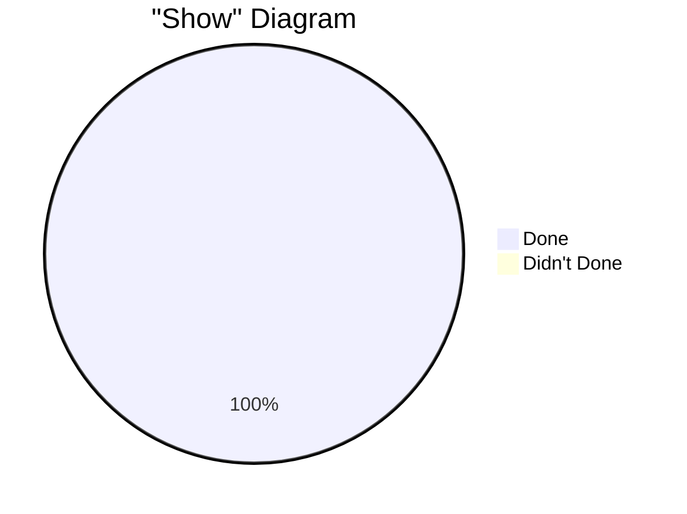
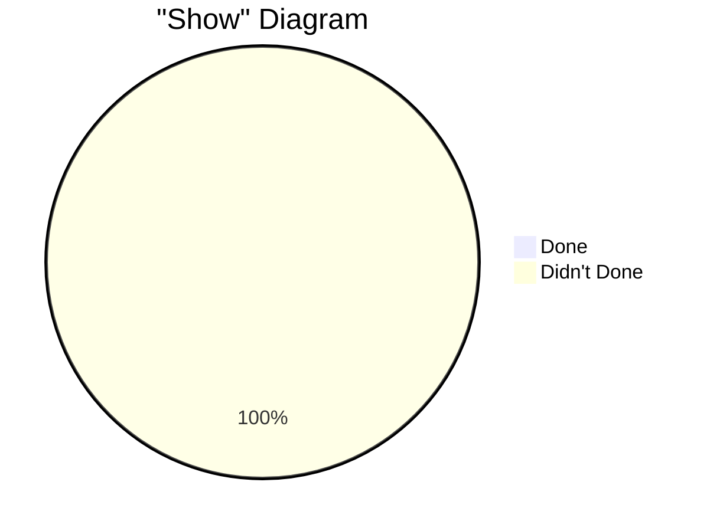
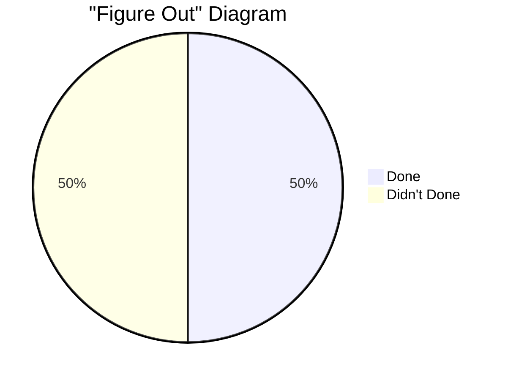
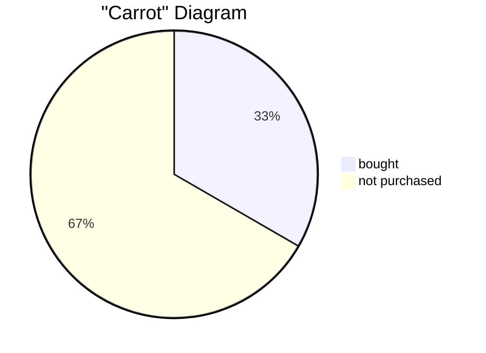
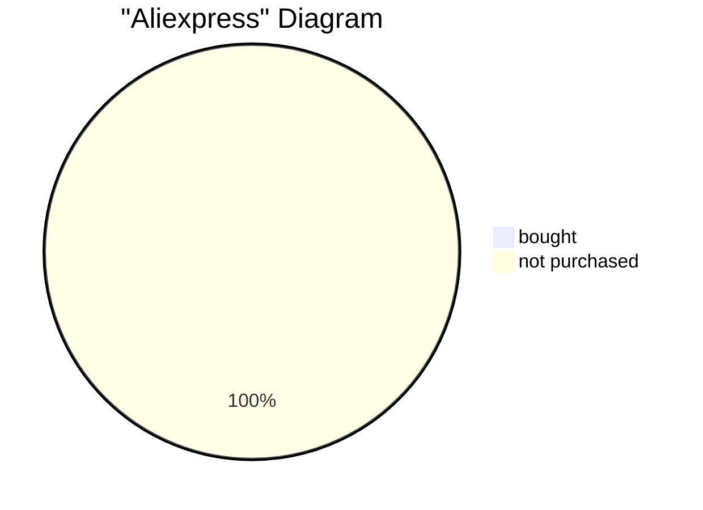
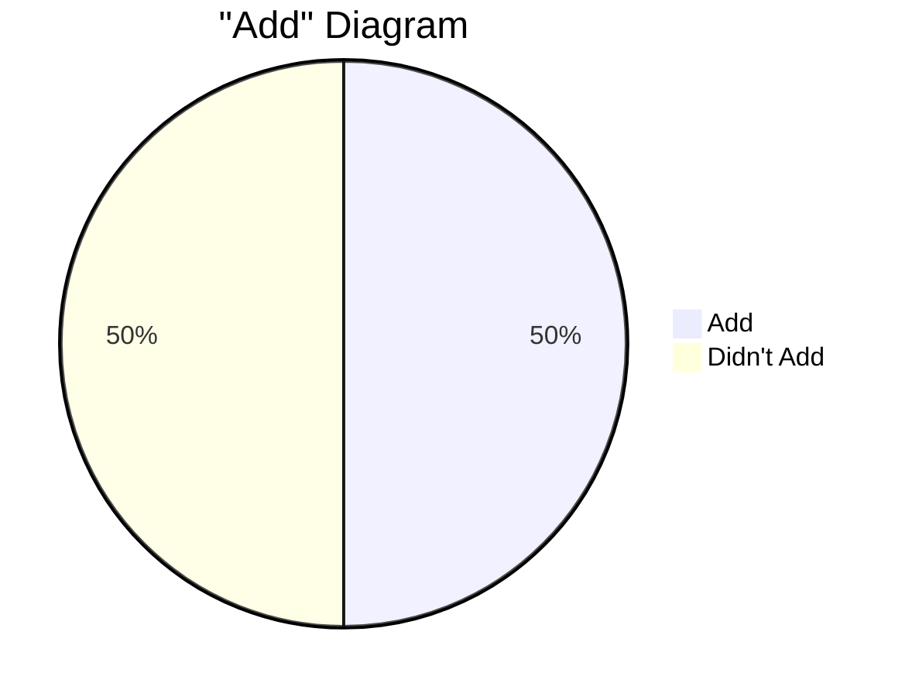
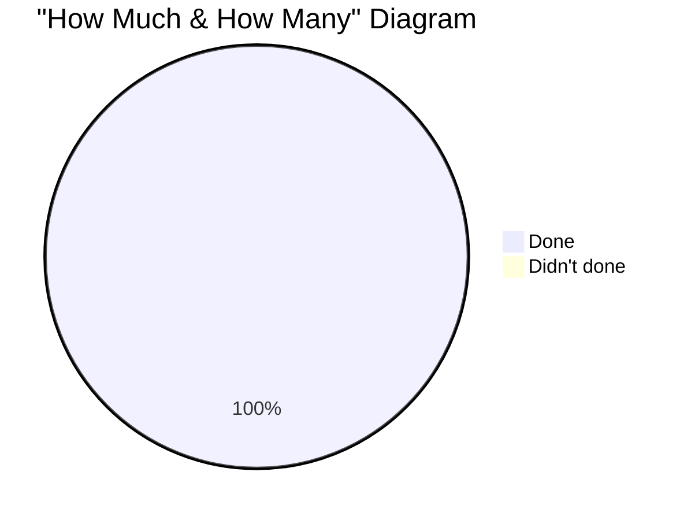

# Tasks

# [go back](../README.md#tasks)

## Downlods

### Downlods
- [x] Download VsCode on PC

## Show

## Show
- [ ] Show VScode Web to Milla 

## Figure Out

### Figure Out
- [x] Figure out how to add another number with iCloud
- [ ] Figure out the battery's properties

# Buy
## Carrot

### Carrot
- [x] Buy BMX
   - [x] money
   - [x] search
   - [x] discussion
   - [x] buy
- [ ] Buy Longboard
   - [ ] money
   - [ ] search
   - [ ] discussion
   - [ ] buy
- [ ] Buy Computer
   - [ ] money
   - [ ] search
   - [ ] buy
- [ ] Buy Iphone 12-14 pro max
   - [ ] money
   - [ ] search
   - [ ] buy

## Aliexpress

### Aliexpress
- [ ] Buy Wifi antenna
   - [ ] money
   - [ ] search
   - [ ] buy 
- [ ] Buy Batteries 18650
   - [ ] money
   - [ ] search 
   - [ ] buy 

### Amplifier
- [ ] Buy Battery for PC 8-20
   - [ ] money
   - [ ] search
   - [ ] buy 

## Add

</style>

### Add
- [x] Add Father to my git repo
- [ ] Add dev.azure BackLog

## How Much & How Many

### How Much & How Many
- [x] How Much 170F in C (77C)
- [x] How Much 40C in F (104F)

<style>
  .mermaid {
    font-size: 0.01px;
    transform: scale(0.8);
    transform-origin: center;
  }